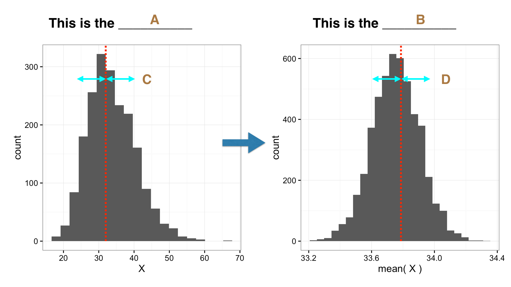

# Exercises 

## Week 2

### What kind of variable is it?

The following table gives a number of measurements taken in the course of a study of a woodland ecosystem. What type of variable results from the measurements taken in each case?

```{r, echo = FALSE}
table_data <- read.csv(file = "./tables_csv/variable_types.csv")
knitr::kable(
  table_data, booktabs = TRUE,
  caption = 'Examples of different kinds of variable.'
)
```

There are no answers to this question on MOLE. If you're not 100% sure what the right answer is in any of these examples, ask a TA or instructor for help.

### Definitions

The figure below is an attempt to represent some of the concepts you've been studying this week (e.g. the sampling distribution, the standard error, etc):

```{r, echo = FALSE, out.width='80%', fig.align='center', fig.cap='What do the letters refer to?'}

```

```{block, type='do-something'}
**MOLE Question**

Assign the appropriate term (sampling distribution, standard error, etc) to the letters A-D in the figure.
```

### What form do sampling distributions take?

```{r, eval=FALSE, echo=FALSE}
set.seed(27081975)
n <- 2000
x1 <- rlnorm(n, sdlog = 0.3); x1 <- x1/mean(x1)
x2 <- rlnorm(n, sdlog = 0.6); x2 <- x2/mean(x2)
x3 <- rlnorm(n, sdlog = 0.9); x3 <- x3/mean(x3)
out <- data.frame(Population = rep(LETTERS[1:3], each = n),
                  Values = c(x1, x2, x3))
write.csv(out, file = "./data_csv/SKEWED_POPULATIONS.CSV", row.names = FALSE)
```

```{r, echo=FALSE}
all_pops <- read.csv(file = "./data_csv/SKEWED_POPULATIONS.CSV")
```

A data file containing variables from three different populations (labelled A, B, and C) is available in SKEWED_POPULATIONS.CSV. Download the SKEWED_POPULATIONS.CSV file from MOLE and place it in your working directory. Read SKEWED_POPULATIONS.CSV into an R data frame called `all_pops`. Examine the data set---both visually and in terms of its descriptive statistics:

**Inspection.** Use the `View` function and `dplyr` function `glimpse` (or `str`) to inspect the 'data'. Which variables are in the data frame? What kind of variables are they (numeric, categorical, etc)? 

**Descriptive statistics.** Use the appropriate `dplyr` functions (`group_by` and `summarise`) to calculate the mean and standard deviation of `Values` in each population. HINT: You will need the `mean` and `sd`functions to help you do this.

**Graphs.** Use `ggplot2` to construct three histograms to summarise the distribution of the variables. HINT: You will need to use `geom_histogram` and the `facet_wrap` functions to do this.

```{block, type='do-something'}
**MOLE Question**

How do the distributions of the three variables differ in terms of their central tendency, dispersion and skewness?

Which variable is the most skewed?
```

Now that you understand a bit about the variables' distribution you can start to use them. You're going to explore how the shape of a variable's distribution influences the sampling distribution of its mean. If you're not sure what that last sentence means, ask a TA for help before proceeding.

The simplest way to tackle this problem is to work with each one in turn, using the the bootstrapping trick to create the sampling distribution of the mean. This involves three steps. First we have to extract the subset of values we require and store these in a numeric vector (step 1). Then we use a bit of R trickery to calculate 1000 bootstrapped means (step 2), and finally, parcel up the result into a data frame (step 3). Here's how this works for variable A:
```{r}
# 1. extract the values of the variable
x <- filter(all_pops, Population == "A")$Values
# 2. carry out the bootstrapping
boot_means <- replicate(1000, mean(sample(x, size = 25, replace = TRUE)))
# 3. wrap up the result as a data frame
plot_df <- data.frame(boot_means)
```
Once we have the bootstrapped sampling distribution of the mean we need to summarise this as a histogram. You should be able to work out how to do this using `ggplot2`. Construct this histogram for each of the variables, paying close attention to the form of the original sample and the bootstrapped sampling distribution of their mean.

```{block, type='do-something'}
**MOLE Question**

Are the sampling distributions of the means more, or less, skewed than the distribution of the corresponding variables?

Which variable (A, B, or C) has the most skewed sampling distribution associated with its mean?
```

You used bootstrapped samples of 25 observations to construct the sampling distributions in the exercise above (`size = 25`). You can change this number by altering the `size ` argument of the `sample` function. Use this fact to explore how the shape of the sampling distribution changes as you increase sample size of the 'C' variable. Start by using only 10 individuals in each bootstrapped sample, and gradually increase this to 100.

```{block, type='do-something'}
**MOLE Question**

What happens to the shape of the sampling distribution of the mean of the 'C' variable as you change the bootstrapped sample size?
```

### How does sample size influence the standard error?

Think back to the plant colour morph example. We used a simulation in R to calculate the approximate sampling distribution of purple morph frequency estimates. We used this to examine how the amount of sampling variation changes with sample size. We noted that, in general, it seems to decline with sample size. The bigger our sample, the more precise our estimate. That might seem obvious, but what form does this relationship take?

We've written an R function to allow you to explore how the size of samples influence the standard error of purple morph frequency estimates. You can read this into R by running the following line of R code (just copy and paste it into the Console):

```{r, eval = TRUE}
sample_plants <- function(samp_sizes, prob) {
  sapply(samp_sizes, function (size) {
    raw_samples <- rbinom(n = 10000, size = size, prob = prob)
    sd(100 * raw_samples / size)
  })
}
```

(You are not expected to understand how this works!)

This will create a function called `sample_plants` that's ready for you to use. Here's how it works:
```{r}
sample_plants(samp_sizes = c(10, 20, 40, 100), prob = 0.4)
```
The first argument, `samp_sizes = c(10, 20, 40, 100)`, provides the set of sample sizes we want the standard errors for, the second argument, `prob = 0.4`, is the frequency of purple plants (expressed as a probability) in the population. The function returns a vector of numbers that are the standard errors at each sample size.

The easiest way to explore the relationship between sample size and standard error is to simply plot it. Since we use `ggplot2`, we need to collect together the inputs and outputs of these simulations into a data frame. Here's one way to do this:
```{r}
sim_data <- 
  data.frame(sample_size = c(10, 20, 40, 100)) %>% 
  mutate(se = sample_plants(sample_size, prob = 0.4))
sim_data
```

Use the above code to vary the sample size from around 20 to 500 (the exact numbers don't matter too much), assuming that the purple morph frequency is 0.4 (`prob = 0.4`). You only need to vary the values assigned to `sample.size` to do this. Make a plot to investigate how the standard error changes as the sample size increases.

```{block, type='do-something'}
**MOLE Question**

Does the standard error halve when you double the sample size, or is the relationship more complicated? If you think the relationship is more complicated, what form does it take?
```

Now repeat the exercise with assuming that the purple morph frequency is 0.1 (`prob = 0.1`).

```{block, type='do-something'}
**MOLE Question**

Does the standard error depend on purple morph frequency? Does it get smaller or larger when we move from a frequency of 0.4 to 0.1?
```


  
